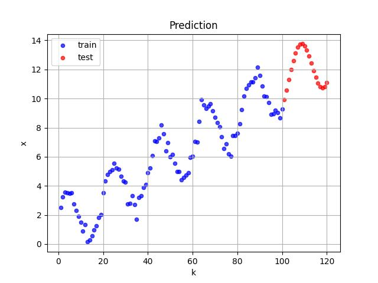

# Nonlinear regression
Решение задания по подбору параметров аналитической модели и прогнозированию временного ряда.
Была дана выборка в файле `train.csv` с данными, генерируемыми по формуле:
`xₖ = a · sin(ω · k + φ) + b · k + c + шум`,
где:
a, ω, φ, b, c — неизвестные параметры,
шум — случайная нормальная добавка с нулевым средним.

## Результат предсказаний

[](result/prediction_plot.jpg)

## Метод решения
Для решения использован аналитический метод подбора параметров через оптимизацию функции потерь (MSE) с помощью `scipy.optimize.curve_fit`.
Качество модели: MSE = 0.14

## Запуск программы
1.  Клонируйте репозиторий:
    ```bash
    git clone https://github.com/KarinaCreate/Nonlinear-regression
    cd Nonlinear-regression
    ```

2.  Установите зависимости:
    ```bash
    pip install -r requirements.txt
    ```

3.  Запустите решение:
    ```bash
    python Nonlinear_regression.py
    ```
